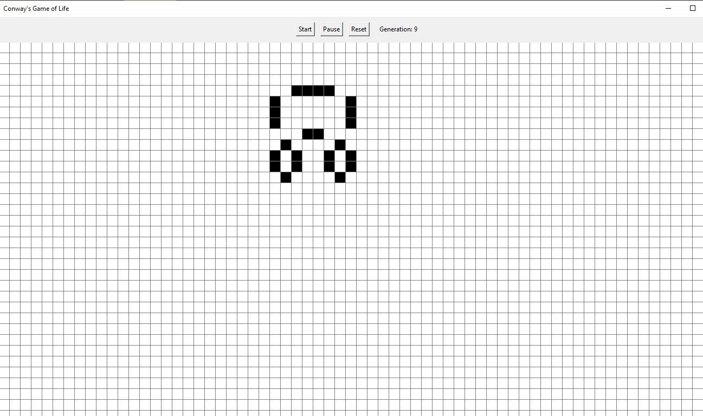
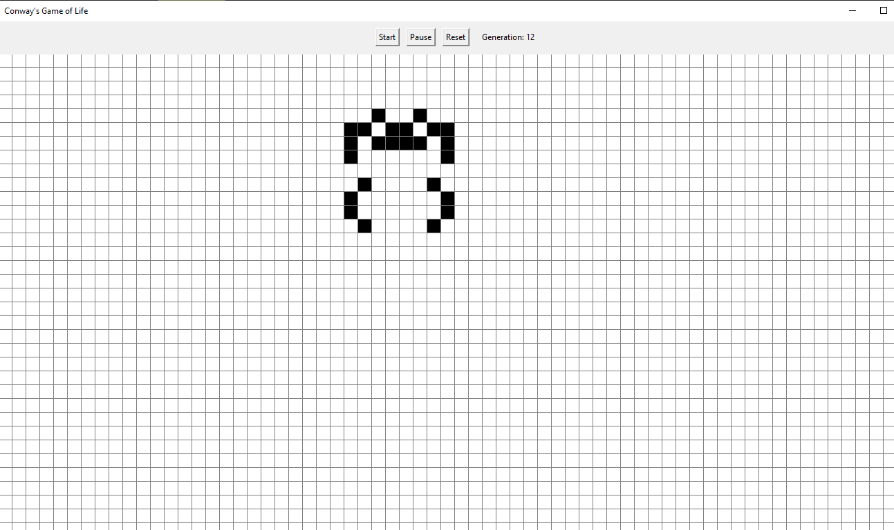
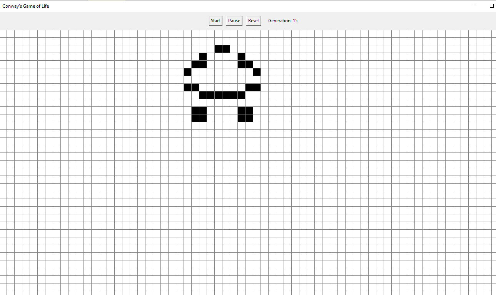

# 🧬 Conway’s Game of Life – Python GUI

An interactive implementation of Conway's Game of Life using Python and Tkinter. This simulation lets users draw an initial pattern on a grid, then start, pause, resume, or reset the evolution process. Built as a hands-on exploration of GUI programming, event-driven logic, and basic cellular automata.

---

## 🎮 Features

- **Interactive Grid**: Click or drag to toggle live cells (10×10 grid).
- **Start / Pause / Resume**: Control the simulation with buttons.
- **Reset**: Clear the grid and reset the generation counter.
- **Real-time Animation**: Grid updates every 0.5 seconds using Tkinter’s `after()` method.
- **Dynamic UI**: Responsive buttons and generation counter update in real time.

---

## 🧠 How It Works

- The grid is a 2D list (list of lists) representing cell states (1 = alive, 0 = dead).
- Mouse input is used to set initial states before simulation starts.
- The simulation uses the standard Game of Life rules:
  - Live cell with 2–3 neighbors → stays alive.
  - Dead cell with exactly 3 neighbors → becomes alive.
  - All other cells → die or stay dead.
- The simulation updates periodically using Tkinter’s event loop (`.after()`).
- GUI elements (buttons, canvas) are managed with `tkinter.Frame`, `Button`, and `Canvas`.

---

## 🛠 Technologies Used

- **Python 3**
- **Tkinter** – Standard Python GUI library
- **Event-driven programming**
- **Basic algorithm design and simulation**

---

## 📸 Screenshots






---

## 🚀 Getting Started

### Requirements

- Python 3.x (no additional packages required)

### Run the app

```bash
python game_of_life_gui.py
